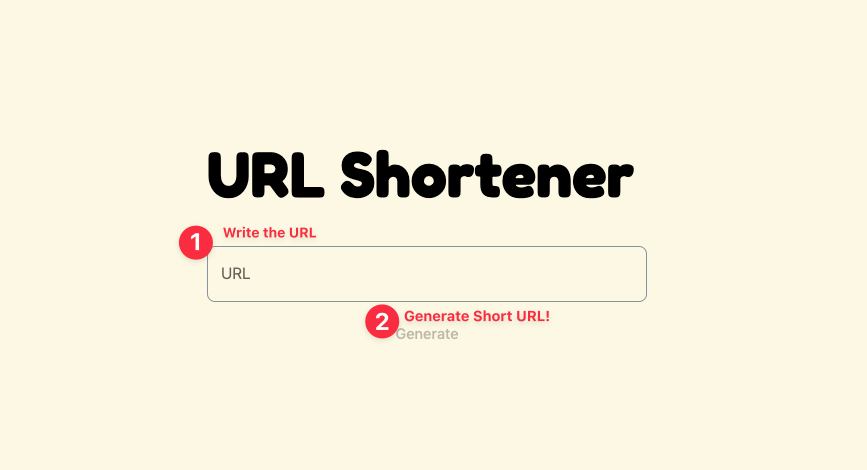
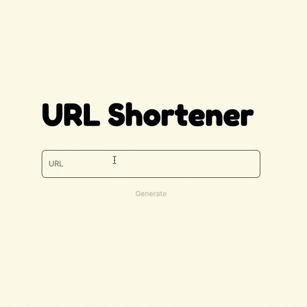

# 🔗 URL Shortener

> A modern URL shortening service that helps you create concise, shareable links.



## ✨ Features

- 🎯 **URL Shortening** - Convert long URLs into short, memorable links
- 🔄 **Quick Redirect** - Fast and reliable redirection to original URLs
- 📱 **QR Code Generation** - Generate QR codes for your shortened URLs

## 🚀 Getting Started

### Prerequisites

- Docker and Docker Compose
- Node.js 18 or higher
- pnpm (recommended)

### Quick Start

1. Clone the repository:

```bash
git clone https://github.com/univdev/url-shortener
cd url-shortener
```

2. Start the service using Docker Compose:

```bash
docker compose --env-file ./apps/server/.env.development up -d
```

## 🛠️ Tech Stack

- **Backend**: NestJS
- **Database**: PostgreSQL
- **ORM**: Prisma
- **Containerization**: Docker

### Features Overview

#### 🔗 URL Shortening

- Input your long URL
- Get an easy-to-share shortened link
- Copy to clipboard with one click

#### 📱 QR Code

- Automatically generated for each shortened URL
- Perfect for offline sharing
- High-quality PNG format



## 📝 License

This project is licensed under the MIT License - see the [LICENSE](LICENSE) file for details.

## 🤝 Contributing

Contributions, issues, and feature requests are welcome!
